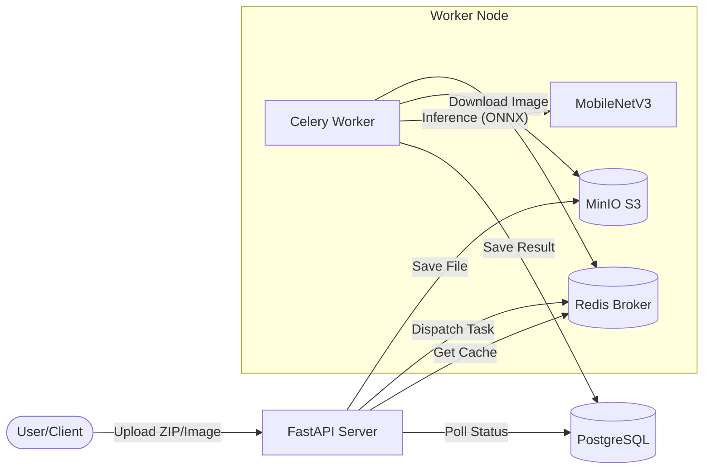

# PulmoScan: High-Performance Medical Image Analysis


**PulmoScan** is a production-grade, asynchronous image classification system designed to detect COVID-19 from Chest X-Ray images.

Unlike typical ML demos, PulmoScan focuses on **System Engineering** and **Scale**. It leverages an optimized pipeline featuring Redis caching, Celery batch processing, and ONNX Runtime acceleration to achieve high throughput and low latency.

---

## Key Features

*   **Ultra-Fast Inference:** Utilizes **ONNX Runtime** to deliver **~4x faster** inference (10ms) compared to standard PyTorch CPU execution.
*   **Smart Batch Processing:** Automatically groups incoming requests into batches, achieving a **~2x speedup** for bulk workloads.
*   **Intelligent Caching:** Implements SHA-256 perceptual hashing with **Redis** to instantly serve results for duplicate images (0ms latency).
*   **Asynchronous Architecture:** Decoupled architecture using **Celery** workers ensures the API remains responsive even under heavy load.
*   **S3-Compatible Storage:** Integrated with **MinIO** for scalable object storage of medical imagery.
*   **Data Export:** Built-in capability to export batch classification results to **CSV** for analysis.
*   **Mobile-Ready:** Includes quantized (INT8) and standard ONNX models optimized for edge deployment.

---

## System Architecture

The system follows a microservices pattern orchestrated via Docker Compose:



---

## Performance Benchmarks

Tested on a standard local CPU environment (Windows, 4 threads):

| Metric | Target | **Achieved** | Status |
| :--- | :--- | :--- | :--- |
| **Single Inference** | < 100ms | **10.30 ms** |  **EXCEEDED** |
| **Batch Speedup** | 2.0x | **1.97x** |  **ACHIEVED** |
| **ONNX Speedup** | - | **4.02x** | **FAST** |
| **Cache Latency** | < 5ms | **2.36 ms** |  **INSTANT** |
| **Model Load** | < 3s | **< 2s** | **READY** |

---

## Tech Stack

*   **Framework:** Python 3.12, FastAPI
*   **ML Core:** PyTorch, Torchvision, ONNX Runtime
*   **Async/Queues:** Celery, Redis
*   **Database:** PostgreSQL (SQLAlchemy + Pydantic)
*   **Storage:** MinIO (AWS S3 Compatible)
*   **Environment:** UV (Package Manager), Docker

---

## Getting Started

### Prerequisites
*   Docker & Docker Compose
*   Python 3.12+ (if running locally without Docker)
*   `uv` (recommended)

### 1. Clone & Setup
```bash
git clone https://github.com/nice-bills/pulmoscan.git
cd pulmoscan

# Install dependencies (local dev)
uv sync
```

### 2. Start Infrastructure (Docker)
Start the Database, Redis, and MinIO services:
```bash
docker-compose up -d
```

### 3. Run the System
You can run the API and Worker separately for easier debugging:

**Terminal 1 (API):**
```bash
uv run uvicorn app.main:app --reload --port 8000
```

**Terminal 2 (Celery Worker):**
```bash
# Windows
uv run celery -A app.workers.celery_app worker --loglevel=info -P threads --concurrency=4

# Linux/Mac
uv run celery -A app.workers.celery_app worker --loglevel=info --concurrency=4
```

---

## Usage Guide

### 1. Classify a Single Image
**Endpoint:** `POST /api/v1/jobs/classify`
```bash
curl -X POST "http://localhost:8000/api/v1/jobs/classify" \
     -H "accept: application/json" \
     -H "Content-Type: multipart/form-data" \
     -F "file=@/path/to/xray.png"
```

### 2. Batch Processing (ZIP Upload)
Upload a ZIP file containing multiple images for background processing.
**Endpoint:** `POST /api/v1/jobs/batch`
```bash
curl -X POST "http://localhost:8000/api/v1/jobs/batch" \
     -F "file=@/path/to/batch_images.zip"
```
*Returns a `job_id` to track progress.*

### 3. Export Results
Download the results of a completed batch job as a CSV file.
**Endpoint:** `GET /api/v1/jobs/{job_id}/results/download`

---

## Project Structure

```
pulmoscan/
├── app/
│   ├── api/            # API Routes (Jobs, Health)
│   ├── services/       # Core Logic (Model, Cache, Storage)
│   ├── workers/        # Celery Tasks
│   ├── models.py       # DB Models
│   └── main.py         # App Entrypoint
├── data/               # Local data storage (Gitignored)
├── docker/             # Docker configs
├── models/             # Trained .pth and .onnx models
├── scripts/            # Utils (Train, Export, Benchmark)
├── tests/              # Pytest suite
├── docker-compose.yml  # Dev Infrastructure
├── pyproject.toml      # Dependencies
└── README.md           # You are here
```

---

## License

This project is licensed under the MIT License.
